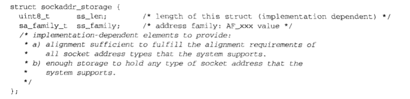

# 第三章 套接字编程简介

## 3.1 概述

地址转换函数在地址的文本表达和它们存放在套接字地址结构中的二进制之间进行转换。

`inet_addr`和`inet_ntoa`常用于`IPv4`，`inet_pton`和`inet_ntop`同时适用于`IPv4`和`IPv6`

## 3.2 套接字地址结构

大多数套接字函数都需要一个指向套接字地址结构的指针作为参数。这届结构的名字均以`sockaddr_`开头。

### IPv4套接字地址结构

`IPv4`套接字地址结构通常也称为“网际套接字地址结构”，以`sockaddr_in`命名，定义在`<netinet/in.h>`头文件中。POSIX定义如下

```c
struct in_addr
{
    in_addr_t s_addr; /* 32-bit IPv4 address */
                      /* network byte ordered */
};

struct sockaddr_in
{
    uint8_t sin_len;         /* length of structure (16) */
    sa_family_t sin_family;  /* AF_INET */
    in_port_t sin_port;      /* 16-bit TCP or UDP port number */
    struct in_addr sin_addr; /* 32-bit IPv4 address */
                             /* network byte ordered */
    char sin_zero[8];        /* unused */
};
```

- `sin_len`长度字段，是为了增加对OSI协议的支持
- POSIX规范只需要这个结构中的三个字段：`sin_family`、`sin_port`和`sin_addr`

### 通用套接字地址结构

当作为一个参数传递进任何套接字函数时，套接字地址总是以引用的形式来传递。在如何声明所传递指针的数据类型上存在一个问题，为了解决这个问题可以采用通用的套接字地址结构，定义在`<sys/socket.h>`

```c
struct sockaddrc
{
    uint8_t sa_len;
    sa_family_t sa_family; /* address family: AF_xxx value */
    char sa_data[14];      /* protocol-specific address */
};
```

例子：

```c
int bind(int, struct sockaddr *, socklen_t);
bin(sockfd, (struct sockaddr *) &serv, sizeof(serv))
```

### IPv6套接字地址结构

`IPv6`套接字地址结构在`<netinet/in.h>`头文件中定义

```c
struct in6_addr
{
    unit8_t s6_addr[16]; /* address family: AF_xxx value */
                         /* protocol-specific address */
};
#define SIN6_LEN /* required for compile-time tests */
struct sockaddr_in6
{
    uint8_t sin6_len;          /* length of this struct (28) */
    sa_family_t sin6_family;   /* AF_INET6 */
    in_port_t sin6_port;       /* transport layer port# */
                               /* network byte ordered */
    uint32_t sin6_flowinfo;    /* flow information, undefined */
    struct in6_addr sin6_addr; /* IPv6 address */
                               /* network byte ordered */
    uint32_t sin6_scope_id;    /* set of interfaces for a scope */
};
```

- 如果系统支持套接字地址结构中的长度字段，那么`SIN6_LEN`常值必须定义
- `IPv6`的地址族是`AF_INET`，`IPv4`的地址族是`AF_INET`
- `sin6_flowinfo`字段分成两个字段
  - 低序20位是流标
  - 高序12位保留

### 新的通用套接字地址结构

新的`struct sockaddr_storage`足以容纳系统所支持的任何套接字地址结构，在`<netinet/in.h>`头文件中定义



和`sockaddr`相比，存在以下两点差别：

1. 如果系统支持的任何套接字地址结构有对齐需要，那么`sockaddr_storage`能够满足最苛刻的对其要求
2. `sockaddr_storage`足够大，能够容纳系统支持的任何套接字地址结构

